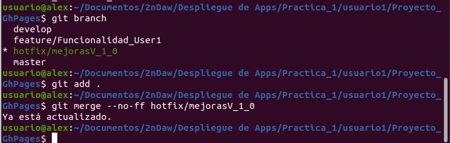

# Alex Zarazua
## Práctica GitHub Pages
* ÍNDICE
* QUÉ ES Y PARA QUÉ SIRVE GIT
* QUÉ ES LA METODOLOGÍA GIT FLOW
* PORQUE LA HEMOS UTILIZADO
* QUE ES GITHUB PAGES
* LA PRÁCTICA

### ¿QUÉ ES GIT,Y PARA QUÉ SIRVE?
 * Git es un sistema de control de versiones, el cual nos puede servir para trabajar en equipo de una manera mucho más simple,cómoda y óptima cuando estamos desarrollando una aplicación o software
* Además de que vamos a poder controlar todos los cambios que se hacen en nuestra aplicación y en nuestro código teniendo acceso al control absoluto de todo lo que pasa en el código, pudiendo volver atrás en el tiempo, pudiendo abrir diferentes ramas de desarrollo, etc.
* De forma que si tenemos dos o tres personas trabajando en ciertas funcionalidades del proyecto,nosotros podemos estar trabajando en nuestra parte del código. Cuando acabamos de desarrollar nuestro código, utilizamos Git para mezclar los cambios con los otros compañeros,de forma que el código se mezcla de manera perfecta sin generar ningún tipo de fallo y de forma rápida.
 * También nos va a proporcionar un listado de los cambios(commits) y podemos volver atrás en el tiempo a cualquiera de esos cambios o commits.

### ¿QUÉ ÉS LA METODOLOGÍA GIT FLOW?
 - Es un flujo de trabajo aplicado a un repositorio Git. Vincent Driessen fue el encargado de popularizarlo, definiendo un modelo estricto de ramificación diseñado en torno a los lanzamientos del proyecto. Es ideal para proyectos que lleven una planificación de entregas iterativas. 
-  Permite la paralelización del desarrollo mediante ramas independientes para la preparación, mantenimiento y publicación de versiones del proyecto, además de que soporta la reparación de errores en cualquier momento.

### ¿POR QUÉ LA HEMOS UTILIZADO ?
 - En este proyecto hemos utilizado la herramienta git flow, ya que podemos desarrollar el proyecto en paralelo , 
 de tal manera que cada uno de los integrantes de este proyecto puede ir desarrollando su parte sin que le moleste las funcionalidades de los demás compañeros.

### La Práctica
El primer paso para esta práctica , es crear tres carpetas para simular los tres usuarios que intervendrán en los siguientes ejercicios.

En segundo lugar,creamos el repositorio en GitHub y posteriormente hacemos un Git clone en cada una de las carpetas que hemos creado anteriormente para simular los distintos usuarios que colaboran en el mismo proyecto.

Seguidamente creamos la estructura inicial en el usuario1 con una features para sus funcionalidades, además de la rama develop.

Creamos la página inicial desde el usuario1

Modificamos el Index.html para que quede com nos indican

Subimos los cambios de la página inicial a la feature del usuario1.

Creamos la develop y la funcionalidad en la carpeta del usuario 2

Nos posicionamos en la feature/funcionalidad_user2, donde realizaremos el git pull --rebase origin  feature/Funcionalidad_USER1 

Creamos el siguiente html llamado modificar_contenido_html.html desde la nueva feature del usuario2 y realizamos la subida a la feature
Vemos los cambios gracias al git status

Añadimos solamente los archivos en los cuales hemos realizado los cambios, como son el index y el nuevo fichero html.

Seguidamente creamos una nueva feature ya que este usuario tiene que implementar una nueva funcionalidad, crear un nuevo archivo html dedicado a la página de atributos html.

Con el comando git checkout -b feature/atributosHtml1 develop creamos la feature y nos posicionamos ya en ella,realizamos un git branch para comprobar que efectivamente estamos posicionados en esta.
Ahora es el turno de crear y modificar el nuevo archivo html.
La página quedaría de tal manera : 

Comprobamos que efectivamente hemos realizado cambios tanto como en el atributos.html como en el index, realizamos el  git add para estos dos archivos, seguido del commit y el push a esta feature.

Una vez terminadas las funcionalidades de cada usuario , procedemos a realizar git merge para pasarlo a la rama master del proyecto.
Empezando por el usuario 1, lo primero que debemos hacer es posicionarnos en la rama master y desde esta hacer un git merge develop.

Ahora le toca al usuario 2
Nos posicionamos en master y comprobamos que cambios hay.

Y realizamos el merge de develop de la feature de atributos
 

Y de la feature/Fucionalidades_user2 que hace referencia al archivo de modificaciones contenido html,más el git push a la rama master
 

Y de esta manera tendremos los cambios de los dos usuarios en la rama master.
Creamos la feature para el usuario 3 que se encargará de los cambios en el CSS.
 

Creamos el archivo modificar_estilos_css y lo modificamos tal que asi.
 

Añadiendo es este un código básico de js que lo que hace es una vez pulses el botón te cambia el tamaño del texto.
Como ya hemos creado la feature y modificado el archivo con el git add, más el commit y push subimos los cambios a la rama.

 

Y creamos una nueva release que contendrá todas las features y con la etiqueta v1.2.3

 
 
 
 
 

Actualizamos los datos en la carpeta del usuario 1 con el git pull
 

Seguidamente procedemos a crear el hotfix en dicho usuario
 

 
 

 
 

 

Lo que podemos visualizar en las anteriores carpetas , es en primer lugar como menciono anteriormente, la creación del hotfix.
En segundo lugar, con el git branch comprobamos que estamos situados en el hotfix y actualizamos los datos.
Seguidamente realizamos el git add y el git commit -m para la posterior subida a remoto.
Lo subimos a remoto con el git push.
Para finalizar, con el git checkout master nos cambiamos a la rama master para actualizarla y subir los cambios al repositorio remoto con el git push origin master.

En esta segunda parte de la práctica les explicaré  paso por paso , cómo hacer un GitHub Pages en vuestro repositorio de GitHub.

El primer paso , obviamente es tener un repositorio github, que está explicado al principio de dicha práctica, no hace falta que al nombre le pongamos un nombre que acabe en .io ya que lo podremos activar teniendo el nombre que nosotros queramos.

Una vez tenemos el repositorio creado, nos dirigimos a los settings/ajustes y encontraremos un apartado de gh pages.

 
 

Lo siguientes que debemos hacer es seleccionar la rama la cual más adelante podremos acceder desde el enlace que nos proporcionará en mi caso, pondré la master.

 

Y guardamos la configuración pulsando en Save.
Como podemos comprobar, la página cargará y ya nos mostrará nuestro enlace de github pages.

 

De esta manera ya podremos acceder mediante la url de gh pages a los archivos de nuestra rama master.

Si por el contrario lo que queremos es tener por una parte el código en la rama master y que cuando accedemos al enlace que no muestre la documentación del proyecto, lo que tenemos que hacer es crear una rama llamada gh-pages y aqui es donde subiremos la documentación, por lo que cuando entremos en nuestra github pages nos mostrará dicha documentación.
Por lo tanto, procedemos a crear la rama y subir la documentación.

 

 

Tenemos la rama de pages con un index.html que más adelante lo cambiaremos por un .md para poderle poner un tema a nuestra página y que la documentación se vea más elegante.
Nos dirigimos a los ajustes del repositorio y al apartado de GitHub Pages donde veremos la opción elegir un tema.

 
 

### Support or Contact
PROYECTO PRÁCTICA GITHUB PAGES , GIT FLOW ALEX ZARAZUA
